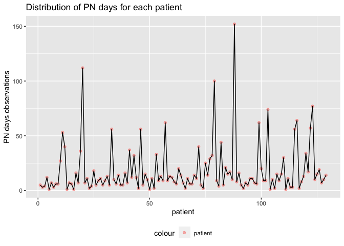

clabsi_data_analysis
================
Jiayi Yang
2022-10-04

Importing and tidying CLABSI data, adding a period of 14 days

``` r
central_lined_df =
  read_excel("./CLABSI_data.xlsx", sheet = 1, range = cell_cols("A:G")) %>% 
  arrange(EMPI) %>% 
  select(EMPI, ordering_date) %>% 
mutate(
  status = "central_lined",
  end_date = ymd(ordering_date) + days(14)
) %>% 
  distinct(EMPI, ordering_date, .keep_all = TRUE) %>% 
  mutate(
      period_1 = interval(ymd(ordering_date), ymd(end_date)),
      date = ordering_date
  ) %>% 
  select(EMPI, status, date, period_1) 

central_lined_df
```

    ## # A tibble: 6,744 × 4
    ##          EMPI status        date                period_1                      
    ##         <dbl> <chr>         <dttm>              <Interval>                    
    ##  1 1000005895 central_lined 2021-04-15 00:00:00 2021-04-15 UTC--2021-04-29 UTC
    ##  2 1000005895 central_lined 2021-05-01 00:00:00 2021-05-01 UTC--2021-05-15 UTC
    ##  3 1000005895 central_lined 2021-04-17 00:00:00 2021-04-17 UTC--2021-05-01 UTC
    ##  4 1000012361 central_lined 2021-05-10 00:00:00 2021-05-10 UTC--2021-05-24 UTC
    ##  5 1000016630 central_lined 2020-11-07 00:00:00 2020-11-07 UTC--2020-11-21 UTC
    ##  6 1000016630 central_lined 2020-11-06 00:00:00 2020-11-06 UTC--2020-11-20 UTC
    ##  7 1000018092 central_lined 2022-03-17 00:00:00 2022-03-17 UTC--2022-03-31 UTC
    ##  8 1000027309 central_lined 2021-01-17 00:00:00 2021-01-17 UTC--2021-01-31 UTC
    ##  9 1000030188 central_lined 2021-04-18 00:00:00 2021-04-18 UTC--2021-05-02 UTC
    ## 10 1000039263 central_lined 2020-03-08 00:00:00 2020-03-08 UTC--2020-03-22 UTC
    ## # … with 6,734 more rows

We have 6744 patients who have central lines inserted in our sample

Bloodstream Infectious importing and cleaning

``` r
bcp_df =
  read_excel("./CLABSI_data.xlsx", sheet = 3, range = cell_cols("A:K")) %>% 
  arrange(EMPI) %>% 
  select(EMPI, PROC_NAME, RESULT_TIME) %>% 
  filter(PROC_NAME == "BLOOD CULTURE") %>% 
  mutate(
  status = "blood_culture_positive",
  date = as.Date(RESULT_TIME, "%y/%m/%d")
)  %>% 
  distinct(EMPI, date, .keep_all = TRUE)
```

    ## Warning in as.POSIXlt.POSIXct(x, tz = tz): unknown timezone '%y/%m/%d'

``` r
bcp_df
```

    ## # A tibble: 2,546 × 5
    ##          EMPI PROC_NAME     RESULT_TIME         status                date      
    ##         <dbl> <chr>         <dttm>              <chr>                 <date>    
    ##  1 1000005895 BLOOD CULTURE 2021-03-20 09:36:00 blood_culture_positi… 2021-03-20
    ##  2 1000005895 BLOOD CULTURE 2021-05-06 09:39:00 blood_culture_positi… 2021-05-06
    ##  3 1000005895 BLOOD CULTURE 2021-05-11 08:51:00 blood_culture_positi… 2021-05-11
    ##  4 1000005895 BLOOD CULTURE 2021-05-03 12:48:00 blood_culture_positi… 2021-05-03
    ##  5 1000016630 BLOOD CULTURE 2020-11-12 15:04:00 blood_culture_positi… 2020-11-12
    ##  6 1000050994 BLOOD CULTURE 2020-03-29 11:02:00 blood_culture_positi… 2020-03-29
    ##  7 1000050994 BLOOD CULTURE 2020-03-28 10:29:00 blood_culture_positi… 2020-03-28
    ##  8 1000070882 BLOOD CULTURE 2021-07-31 12:06:00 blood_culture_positi… 2021-07-31
    ##  9 1000070882 BLOOD CULTURE 2021-08-01 14:21:00 blood_culture_positi… 2021-08-01
    ## 10 1000073127 BLOOD CULTURE 2021-07-19 11:24:00 blood_culture_positi… 2021-07-19
    ## # … with 2,536 more rows

We have 2546 patients who have blood culture positive shown in the EMR
in our sample

Next, see if result_time of BCP aligns with central line insert period.
Trying to join central_lined_df and bcp_df to see patients who are cl
inserted and bcp

``` r
join_cl_bcp =
  left_join(central_lined_df, bcp_df, by = c("EMPI")) %>%
  mutate(
    bcp_status = ifelse(date.y %within% period_1, 1, 0)
  ) %>%    
drop_na() %>% 
  select(EMPI, bcp_status)

join_cl_bcp
```

    ## # A tibble: 5,667 × 2
    ##          EMPI bcp_status
    ##         <dbl>      <dbl>
    ##  1 1000005895          0
    ##  2 1000005895          0
    ##  3 1000005895          0
    ##  4 1000005895          0
    ##  5 1000005895          0
    ##  6 1000005895          1
    ##  7 1000005895          1
    ##  8 1000005895          1
    ##  9 1000005895          0
    ## 10 1000005895          0
    ## # … with 5,657 more rows

Great, we found 5667 observations of patients who have blood culture
positive within the 14-day period of central line inserted.

Incidence of bcp in central lined patients are 5667 / 6744.

make an EDA table

``` r
EDA_plot =
  left_join(central_lined_df, join_cl_bcp, by = c("EMPI")) %>% 
  drop_na()
EDA_plot
```

    ## # A tibble: 21,659 × 5
    ##          EMPI status  date                period_1                       bcp_s…¹
    ##         <dbl> <chr>   <dttm>              <Interval>                       <dbl>
    ##  1 1000005895 centra… 2021-04-15 00:00:00 2021-04-15 UTC--2021-04-29 UTC       0
    ##  2 1000005895 centra… 2021-04-15 00:00:00 2021-04-15 UTC--2021-04-29 UTC       0
    ##  3 1000005895 centra… 2021-04-15 00:00:00 2021-04-15 UTC--2021-04-29 UTC       0
    ##  4 1000005895 centra… 2021-04-15 00:00:00 2021-04-15 UTC--2021-04-29 UTC       0
    ##  5 1000005895 centra… 2021-04-15 00:00:00 2021-04-15 UTC--2021-04-29 UTC       0
    ##  6 1000005895 centra… 2021-04-15 00:00:00 2021-04-15 UTC--2021-04-29 UTC       1
    ##  7 1000005895 centra… 2021-04-15 00:00:00 2021-04-15 UTC--2021-04-29 UTC       1
    ##  8 1000005895 centra… 2021-04-15 00:00:00 2021-04-15 UTC--2021-04-29 UTC       1
    ##  9 1000005895 centra… 2021-04-15 00:00:00 2021-04-15 UTC--2021-04-29 UTC       0
    ## 10 1000005895 centra… 2021-04-15 00:00:00 2021-04-15 UTC--2021-04-29 UTC       0
    ## # … with 21,649 more rows, and abbreviated variable name ¹​bcp_status

Next, we look at TPN data

``` r
tpn_df =
   read_excel("./CLABSI_data.xlsx", sheet = 4, range = cell_cols("A:K")) %>% 
  arrange(EMPI) %>% 
  select(EMPI, START_DATE, END_DATE) %>% 
  mutate(
    status = "tpn"
  )
tpn_df
```

    ## # A tibble: 2,310 × 4
    ##          EMPI START_DATE          END_DATE            status
    ##         <dbl> <dttm>              <dttm>              <chr> 
    ##  1 1000039263 2020-03-24 00:00:00 2020-03-25 00:00:00 tpn   
    ##  2 1000039263 2020-03-25 00:00:00 2020-03-26 00:00:00 tpn   
    ##  3 1000039263 2020-03-26 00:00:00 2020-03-27 00:00:00 tpn   
    ##  4 1000039263 2020-03-27 00:00:00 2020-03-28 00:00:00 tpn   
    ##  5 1000039263 2020-03-28 00:00:00 2020-03-29 00:00:00 tpn   
    ##  6 1000391782 2021-07-24 00:00:00 2021-07-25 00:00:00 tpn   
    ##  7 1000391782 2021-07-25 00:00:00 2021-07-26 00:00:00 tpn   
    ##  8 1000391782 2021-07-29 00:00:00 2021-07-30 00:00:00 tpn   
    ##  9 1000708322 2020-06-05 00:00:00 2020-06-06 00:00:00 tpn   
    ## 10 1000708322 2020-06-06 00:00:00 2020-06-07 00:00:00 tpn   
    ## # … with 2,300 more rows

``` r
distr_plot = 
  tpn_df %>% 
    group_by(EMPI) %>% 
 summarize(n_obs = n()) %>% 
   mutate(patient = 1:n(),
          patient = as.integer(patient))
ggplot(distr_plot, aes(x = n_obs)) +
  geom_histogram() + scale_x_continuous(breaks = seq(0, 150, by = 10)) + scale_y_continuous(breaks = seq(0, 40, by = 2)) +
  labs(
    title = "Distribution of PN days for patients",
    x = "# of days on PN",
    y = "# of patients were on PN for that many days"
  ) 
```

    ## `stat_bin()` using `bins = 30`. Pick better value with `binwidth`.

<!-- -->

``` r
distr_plot
```

    ## # A tibble: 129 × 3
    ##          EMPI n_obs patient
    ##         <dbl> <int>   <int>
    ##  1 1000039263     5       1
    ##  2 1000391782     3       2
    ##  3 1000708322     4       3
    ##  4 1000735510    12       4
    ##  5 1000757776     1       5
    ##  6 1000990516     7       6
    ##  7 1001046352     3       7
    ##  8 1001636642     6       8
    ##  9 1001668036     6       9
    ## 10 1002360958    27      10
    ## # … with 119 more rows

\##`{r} ggplot(distr_plot, aes(x = patient, y = n_obs)) +    geom_point(aes(color = "patient"), alpha = .5) +   geom_line(na.rm = FALSE) +   labs(     title = "Distribution of PN days for each patient",     x = "patient",     y = "PN days observations"   ) +      theme(legend.position = "bottom") ##`

## R Markdown
