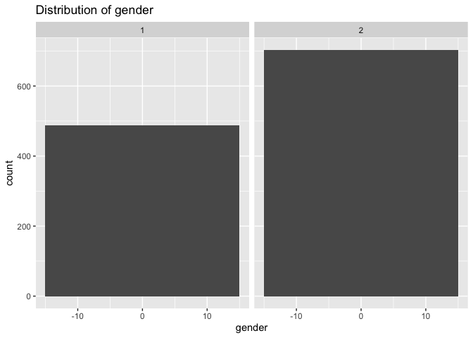

New Data Analysis
================
Jiayi Yang
2022-11-16

``` r
library("MatchIt")
library(survival)
library(gtsummary)
```

import the new data

``` r
new_data = 
  read_excel("./LDA.xlsx", sheet = 1, range = cell_cols("A:K")) %>% 
  filter(flo_meas_name %in% c(  'G IP NYC LDA MIDLINE DOUBLE LUMEN',
                                'G IP NYC LDA MIDLINE SINGLE LUMEN',
                                'G LDA PULMONARY ARTERY CATHETER/SWAN GANZ',
                                'LDA CVC QUADRUPLE LUMEN',
                                'LDA CVC SINGLE LUMEN',
                                'LDA CVC TRIPLE LUMEN',
                                'LDA DUAL LUMEN PORT',
                                'LDA EXTERNAL URINARY CATHETER',
                                'LDA PICC SINGLE LUMEN',
                                'LDA PICC TRIPLE LUMEN',
                                'LDA PUMP DEVICE',
                                'NYC LDA PRESSURE INJURY',
                                'RETIRED - NYC ADT TC PICC DOUBLE LUMEN')
         ) %>% 
  mutate(
    placement_date = as.Date(PLACEMENT_INSTANT, "%y/%m/%d"),
    removal_date = as.Date(REMOVAL_INSTANT, "%y/%m/%d"),
    duration = removal_date - placement_date
  ) %>% 
  filter(removal_date != '2157-11-19')
```

    ## Warning in as.POSIXlt.POSIXct(x, tz = tz): unknown timezone '%y/%m/%d'

    ## Warning in as.POSIXlt.POSIXct(x, tz = tz): unknown timezone '%y/%m/%d'

``` r
new_data
```

    ## # A tibble: 6,754 × 14
    ##          EMPI BIRTH_DATE          sex_c PAT_ENC_CSN_ID hosp_admsn_time    
    ##         <dbl> <dttm>              <dbl>          <dbl> <dttm>             
    ##  1 1000039263 1937-04-28 00:00:00     2      115794137 2020-02-05 01:08:00
    ##  2 1000087431 1945-05-18 00:00:00     1      150005039 2021-07-02 15:08:00
    ##  3 1000087431 1945-05-18 00:00:00     1      150005039 2021-07-02 15:08:00
    ##  4 1000092404 1942-03-24 00:00:00     1      190464289 2022-05-07 10:23:00
    ##  5 1000092404 1942-03-24 00:00:00     1      190464289 2022-05-07 10:23:00
    ##  6 1000172922 1950-09-19 00:00:00     1      186868549 2022-03-31 22:09:00
    ##  7 1000178374 1987-03-12 00:00:00     2      179436960 2022-01-10 02:25:00
    ##  8 1000039263 1937-04-28 00:00:00     2      115794137 2020-02-05 01:08:00
    ##  9 1000039263 1937-04-28 00:00:00     2      115794137 2020-02-05 01:08:00
    ## 10 1000087431 1945-05-18 00:00:00     1      150005039 2021-07-02 15:08:00
    ## # … with 6,744 more rows, and 9 more variables: hosp_disch_time <dttm>,
    ## #   FLO_MEAS_ID <dbl>, PLACEMENT_INSTANT <dttm>, REMOVAL_INSTANT <dttm>,
    ## #   DESCRIPTION <chr>, flo_meas_name <chr>, placement_date <date>,
    ## #   removal_date <date>, duration <drtn>

``` r
new_data2 = new_data[!duplicated(new_data$EMPI), ] 
```

We have 6754 patients who have central lines inserted in our sample

``` r
bcp_df =
  read_excel("./CLABSI_data.xlsx", sheet = 3, range = cell_cols("A:K")) %>% 
  arrange(EMPI) %>% 
  select(EMPI, PROC_NAME, RESULT_TIME) %>% 
  filter(PROC_NAME == "BLOOD CULTURE") %>% 
  mutate(
  status = "blood_culture_positive",
  date = as.Date(RESULT_TIME, "%y/%m/%d")
)  %>% 
  distinct(EMPI, date, .keep_all = TRUE)
```

    ## Warning in as.POSIXlt.POSIXct(x, tz = tz): unknown timezone '%y/%m/%d'

``` r
bcp_df
```

    ## # A tibble: 2,546 × 5
    ##          EMPI PROC_NAME     RESULT_TIME         status                date      
    ##         <dbl> <chr>         <dttm>              <chr>                 <date>    
    ##  1 1000005895 BLOOD CULTURE 2021-03-20 09:36:00 blood_culture_positi… 2021-03-20
    ##  2 1000005895 BLOOD CULTURE 2021-05-06 09:39:00 blood_culture_positi… 2021-05-06
    ##  3 1000005895 BLOOD CULTURE 2021-05-11 08:51:00 blood_culture_positi… 2021-05-11
    ##  4 1000005895 BLOOD CULTURE 2021-05-03 12:48:00 blood_culture_positi… 2021-05-03
    ##  5 1000016630 BLOOD CULTURE 2020-11-12 15:04:00 blood_culture_positi… 2020-11-12
    ##  6 1000050994 BLOOD CULTURE 2020-03-29 11:02:00 blood_culture_positi… 2020-03-29
    ##  7 1000050994 BLOOD CULTURE 2020-03-28 10:29:00 blood_culture_positi… 2020-03-28
    ##  8 1000070882 BLOOD CULTURE 2021-07-31 12:06:00 blood_culture_positi… 2021-07-31
    ##  9 1000070882 BLOOD CULTURE 2021-08-01 14:21:00 blood_culture_positi… 2021-08-01
    ## 10 1000073127 BLOOD CULTURE 2021-07-19 11:24:00 blood_culture_positi… 2021-07-19
    ## # … with 2,536 more rows

We have 2546 patients who have blood culture positive shown in the EMR
in our sample

Next, see if result_time of BCP aligns with central line insert period.
Trying to join central_lined_df and bcp_df to see patients who are cl
inserted and bcp during their central line placement period.

``` r
join_test=
join_cl_bcp =
  left_join(new_data, bcp_df, by = c("EMPI")) %>%
  mutate(
   period_1 = interval(ymd(placement_date), ymd(removal_date)),
   cl_duration_time = difftime(ymd(removal_date), ymd(placement_date), units="days"),
    bcp_status = ifelse(date %within% period_1, 1, 0)
  ) %>%    

  select(EMPI, bcp_status, date, placement_date, removal_date, period_1, cl_duration_time) %>% 
  arrange(EMPI, desc(bcp_status))
  
join_test2 = join_test[!duplicated(join_test$EMPI), ] %>% 
  mutate(
    matching_period = date - placement_date,
    new_bcp_status = ifelse(is.na(bcp_status), 0, bcp_status)
  )

table(join_test2$new_bcp_status)
```

    ## 
    ##    0    1 
    ## 1840  595

Great, we found 595 observations of patients who have blood culture
positive within their periods of central line inserted.

The incidence for blood culture positive in central lined patients are
595/6754 = 8.8%

Now we try to match controls to cases by first full join the bcp_status
table (join_test2) with our original new_data table:

``` r
full_table = 
  full_join(new_data, join_test2, by = c("EMPI")) 
full_table2 = full_table[!duplicated(full_table$EMPI), ] 

full_table2$bcp_status[is.na(full_table2$new_bcp_status)] <- 0

table(full_table2$new_bcp_status)
```

    ## 
    ##    0    1 
    ## 1840  595

We have 595 cases and 1840 unique controls to pool from. `full_table2`
is the full table until now.

Matching by variable `matching_period` which stands for the time between
central line placement and tested blood culture positive

### Matching

by MatchIt:

``` r
full_table3 = full_table2 %>% 
  mutate(
    new_matching_period = ifelse(is.na(matching_period), 0, matching_period)
  )

set.seed(1234)
match.it <- matchit(new_bcp_status ~ new_matching_period, data = full_table3, method="nearest", ratio=1)
matched_df <- summary(match.it)

knitr::kable(matched_df$nn, digits = 2, align = 'c', 
      caption = 'Table 2: Sample sizes')
```

|               | Control | Treated |
|:--------------|:-------:|:-------:|
| All (ESS)     |  1840   |   595   |
| All           |  1840   |   595   |
| Matched (ESS) |   595   |   595   |
| Matched       |   595   |   595   |
| Unmatched     |  1245   |    0    |
| Discarded     |    0    |    0    |

Table 2: Sample sizes

We have 595 cases and 595 matched controls by their matching period(time
of central line inserted to time of bcp). There are 1245 remained
unmatched, the total of the sample population is 2435.

save the matched dataset into a new dataframe named `df.match`

``` r
df.match <- match.data(match.it)[1:ncol(full_table3)]
rm(matched_df)

df.match %>% 
  mutate(
    BIRTH_DATE = as.Date(BIRTH_DATE, "%y/%m/%d"),
    sex_c = case_when(sex_c == 1 ~ "Male",
              sex_c == 2 ~ "Female") %>% 
      as.factor()
  ) 
```

    ## Warning in as.POSIXlt.POSIXct(x, tz = tz): unknown timezone '%y/%m/%d'

    ## # A tibble: 1,190 × 23
    ##          EMPI BIRTH_DATE sex_c  PAT_EN…¹ hosp_admsn_time     hosp_disch_time    
    ##         <dbl> <date>     <fct>     <dbl> <dttm>              <dttm>             
    ##  1 1000039263 1937-04-28 Female   1.16e8 2020-02-05 01:08:00 2020-04-01 00:27:00
    ##  2 1000087431 1945-05-18 Male     1.50e8 2021-07-02 15:08:00 2021-07-18 16:52:00
    ##  3 1000092404 1942-03-24 Male     1.90e8 2022-05-07 10:23:00 2022-05-21 05:15:00
    ##  4 1000172922 1950-09-19 Male     1.87e8 2022-03-31 22:09:00 2022-04-07 03:03:00
    ##  5 1000178374 1987-03-12 Female   1.79e8 2022-01-10 02:25:00 2022-01-20 18:35:00
    ##  6 1000018092 1953-10-27 Male     1.85e8 2022-03-12 19:48:00 2022-04-26 16:22:00
    ##  7 1000135489 1989-11-02 Male     1.28e8 2020-10-01 10:00:00 2020-10-08 17:09:00
    ##  8 1000016630 1980-01-06 Female   1.28e8 2020-10-30 10:40:00 2020-11-15 09:33:00
    ##  9 1000070882 1958-08-08 Female   1.52e8 2021-07-28 00:33:00 2021-08-12 19:00:00
    ## 10 1000086187 1949-01-22 Female   1.74e8 2021-11-29 16:05:00 2022-01-10 18:10:00
    ## # … with 1,180 more rows, 17 more variables: FLO_MEAS_ID <dbl>,
    ## #   PLACEMENT_INSTANT <dttm>, REMOVAL_INSTANT <dttm>, DESCRIPTION <chr>,
    ## #   flo_meas_name <chr>, placement_date.x <date>, removal_date.x <date>,
    ## #   duration <drtn>, bcp_status <dbl>, date <date>, placement_date.y <date>,
    ## #   removal_date.y <date>, period_1 <Interval>, cl_duration_time <drtn>,
    ## #   matching_period <drtn>, new_bcp_status <dbl>, new_matching_period <dbl>,
    ## #   and abbreviated variable name ¹​PAT_ENC_CSN_ID

``` r
df.match
```

    ## # A tibble: 1,190 × 23
    ##          EMPI BIRTH_DATE          sex_c PAT_ENC_CSN_ID hosp_admsn_time    
    ##         <dbl> <dttm>              <dbl>          <dbl> <dttm>             
    ##  1 1000039263 1937-04-28 00:00:00     2      115794137 2020-02-05 01:08:00
    ##  2 1000087431 1945-05-18 00:00:00     1      150005039 2021-07-02 15:08:00
    ##  3 1000092404 1942-03-24 00:00:00     1      190464289 2022-05-07 10:23:00
    ##  4 1000172922 1950-09-19 00:00:00     1      186868549 2022-03-31 22:09:00
    ##  5 1000178374 1987-03-12 00:00:00     2      179436960 2022-01-10 02:25:00
    ##  6 1000018092 1953-10-27 00:00:00     1      185024635 2022-03-12 19:48:00
    ##  7 1000135489 1989-11-02 00:00:00     1      127547323 2020-10-01 10:00:00
    ##  8 1000016630 1980-01-06 00:00:00     2      128010373 2020-10-30 10:40:00
    ##  9 1000070882 1958-08-08 00:00:00     2      151803384 2021-07-28 00:33:00
    ## 10 1000086187 1949-01-22 00:00:00     2      174308016 2021-11-29 16:05:00
    ## # … with 1,180 more rows, and 18 more variables: hosp_disch_time <dttm>,
    ## #   FLO_MEAS_ID <dbl>, PLACEMENT_INSTANT <dttm>, REMOVAL_INSTANT <dttm>,
    ## #   DESCRIPTION <chr>, flo_meas_name <chr>, placement_date.x <date>,
    ## #   removal_date.x <date>, duration <drtn>, bcp_status <dbl>, date <date>,
    ## #   placement_date.y <date>, removal_date.y <date>, period_1 <Interval>,
    ## #   cl_duration_time <drtn>, matching_period <drtn>, new_bcp_status <dbl>,
    ## #   new_matching_period <dbl>

df.match has 1190 observations include 595 cases and 595 controls

Look at the exposure TPN status Next, we look at TPN data

``` r
tpn_df =
   read_excel("./CLABSI_data.xlsx", sheet = 4, range = cell_cols("A:K")) %>% 
  arrange(EMPI) %>% 
  select(EMPI, START_DATE, END_DATE) %>% 
  mutate(
    status = "tpn"
  )
join_tpn = 
  left_join(df.match, tpn_df, by = c("EMPI")) %>% 
  mutate(
    tpn_status = ifelse(START_DATE %within% period_1, 1, 0)
  ) %>% 
    arrange(EMPI, desc(tpn_status)) %>% 
  select(EMPI, BIRTH_DATE, sex_c, new_bcp_status, period_1, START_DATE, END_DATE, tpn_status, duration, hosp_admsn_time, new_matching_period) %>% 
  mutate(
    new_tpn_status = ifelse(is.na(tpn_status), 0, tpn_status)
  ) %>% 
  mutate(
    birth_date = as.Date(gsub(BIRTH_DATE,pattern="00:00:00",replacement="",fixed=T)),
    hosp_admsn_date = as.Date(gsub(hosp_admsn_time,pattern="00:00:00",replacement="",fixed=T)),
    age = year(hosp_admsn_date) - year(birth_date)
  ) %>% 
    distinct(EMPI, .keep_all = TRUE) 

tpn_table = join_tpn%>% 
    janitor::tabyl(new_tpn_status, new_bcp_status)
tpn_table
```

    ##  new_tpn_status   0   1
    ##               0 575 577
    ##               1  20  18

This is the 2\*2 table of exposure on the left, outcome on the right. OR
= ad/bc = 0.8969

## Table and Univariate Analysis

``` r
head(join_tpn)
```

    ## # A tibble: 6 × 15
    ##         EMPI BIRTH_DATE          sex_c new_bcp_…¹ period_1                      
    ##        <dbl> <dttm>              <dbl>      <dbl> <Interval>                    
    ## 1 1000016630 1980-01-06 00:00:00     2          0 2020-11-06 UTC--2020-11-08 UTC
    ## 2 1000018092 1953-10-27 00:00:00     1          0 2022-04-11 UTC--2022-04-11 UTC
    ## 3 1000027309 1962-03-10 00:00:00     1          0 2021-01-17 UTC--2021-01-22 UTC
    ## 4 1000039263 1937-04-28 00:00:00     2          0 2020-02-29 UTC--2020-03-10 UTC
    ## 5 1000070882 1958-08-08 00:00:00     2          1 2021-08-01 UTC--2021-08-03 UTC
    ## 6 1000086187 1949-01-22 00:00:00     2          1 2020-04-26 UTC--2020-05-12 UTC
    ## # … with 10 more variables: START_DATE <dttm>, END_DATE <dttm>,
    ## #   tpn_status <dbl>, duration <drtn>, hosp_admsn_time <dttm>,
    ## #   new_matching_period <dbl>, new_tpn_status <dbl>, birth_date <date>,
    ## #   hosp_admsn_date <date>, age <dbl>, and abbreviated variable name
    ## #   ¹​new_bcp_status

``` r
join_tpn$sex_c[join_tpn$sex_c == "1"] <- "Female"
join_tpn$sex_c[join_tpn$sex_c == "2"] <- "Male"
#for simplicity select only sex_c, new_bcp_status, and age
trial <- join_tpn %>% 
  select(new_bcp_status, sex_c, age) %>% 
  mutate(
    new_bcp_status = as.factor(new_bcp_status),
    sex_c = as.factor(sex_c)
  ) 

trial %>% tbl_summary()
```

<div id="pzveloiefp" style="padding-left:0px;padding-right:0px;padding-top:10px;padding-bottom:10px;overflow-x:auto;overflow-y:auto;width:auto;height:auto;">
<style>html {
  font-family: -apple-system, BlinkMacSystemFont, 'Segoe UI', Roboto, Oxygen, Ubuntu, Cantarell, 'Helvetica Neue', 'Fira Sans', 'Droid Sans', Arial, sans-serif;
}

#pzveloiefp .gt_table {
  display: table;
  border-collapse: collapse;
  margin-left: auto;
  margin-right: auto;
  color: #333333;
  font-size: 16px;
  font-weight: normal;
  font-style: normal;
  background-color: #FFFFFF;
  width: auto;
  border-top-style: solid;
  border-top-width: 2px;
  border-top-color: #A8A8A8;
  border-right-style: none;
  border-right-width: 2px;
  border-right-color: #D3D3D3;
  border-bottom-style: solid;
  border-bottom-width: 2px;
  border-bottom-color: #A8A8A8;
  border-left-style: none;
  border-left-width: 2px;
  border-left-color: #D3D3D3;
}

#pzveloiefp .gt_heading {
  background-color: #FFFFFF;
  text-align: center;
  border-bottom-color: #FFFFFF;
  border-left-style: none;
  border-left-width: 1px;
  border-left-color: #D3D3D3;
  border-right-style: none;
  border-right-width: 1px;
  border-right-color: #D3D3D3;
}

#pzveloiefp .gt_caption {
  padding-top: 4px;
  padding-bottom: 4px;
}

#pzveloiefp .gt_title {
  color: #333333;
  font-size: 125%;
  font-weight: initial;
  padding-top: 4px;
  padding-bottom: 4px;
  padding-left: 5px;
  padding-right: 5px;
  border-bottom-color: #FFFFFF;
  border-bottom-width: 0;
}

#pzveloiefp .gt_subtitle {
  color: #333333;
  font-size: 85%;
  font-weight: initial;
  padding-top: 0;
  padding-bottom: 6px;
  padding-left: 5px;
  padding-right: 5px;
  border-top-color: #FFFFFF;
  border-top-width: 0;
}

#pzveloiefp .gt_bottom_border {
  border-bottom-style: solid;
  border-bottom-width: 2px;
  border-bottom-color: #D3D3D3;
}

#pzveloiefp .gt_col_headings {
  border-top-style: solid;
  border-top-width: 2px;
  border-top-color: #D3D3D3;
  border-bottom-style: solid;
  border-bottom-width: 2px;
  border-bottom-color: #D3D3D3;
  border-left-style: none;
  border-left-width: 1px;
  border-left-color: #D3D3D3;
  border-right-style: none;
  border-right-width: 1px;
  border-right-color: #D3D3D3;
}

#pzveloiefp .gt_col_heading {
  color: #333333;
  background-color: #FFFFFF;
  font-size: 100%;
  font-weight: normal;
  text-transform: inherit;
  border-left-style: none;
  border-left-width: 1px;
  border-left-color: #D3D3D3;
  border-right-style: none;
  border-right-width: 1px;
  border-right-color: #D3D3D3;
  vertical-align: bottom;
  padding-top: 5px;
  padding-bottom: 6px;
  padding-left: 5px;
  padding-right: 5px;
  overflow-x: hidden;
}

#pzveloiefp .gt_column_spanner_outer {
  color: #333333;
  background-color: #FFFFFF;
  font-size: 100%;
  font-weight: normal;
  text-transform: inherit;
  padding-top: 0;
  padding-bottom: 0;
  padding-left: 4px;
  padding-right: 4px;
}

#pzveloiefp .gt_column_spanner_outer:first-child {
  padding-left: 0;
}

#pzveloiefp .gt_column_spanner_outer:last-child {
  padding-right: 0;
}

#pzveloiefp .gt_column_spanner {
  border-bottom-style: solid;
  border-bottom-width: 2px;
  border-bottom-color: #D3D3D3;
  vertical-align: bottom;
  padding-top: 5px;
  padding-bottom: 5px;
  overflow-x: hidden;
  display: inline-block;
  width: 100%;
}

#pzveloiefp .gt_group_heading {
  padding-top: 8px;
  padding-bottom: 8px;
  padding-left: 5px;
  padding-right: 5px;
  color: #333333;
  background-color: #FFFFFF;
  font-size: 100%;
  font-weight: initial;
  text-transform: inherit;
  border-top-style: solid;
  border-top-width: 2px;
  border-top-color: #D3D3D3;
  border-bottom-style: solid;
  border-bottom-width: 2px;
  border-bottom-color: #D3D3D3;
  border-left-style: none;
  border-left-width: 1px;
  border-left-color: #D3D3D3;
  border-right-style: none;
  border-right-width: 1px;
  border-right-color: #D3D3D3;
  vertical-align: middle;
  text-align: left;
}

#pzveloiefp .gt_empty_group_heading {
  padding: 0.5px;
  color: #333333;
  background-color: #FFFFFF;
  font-size: 100%;
  font-weight: initial;
  border-top-style: solid;
  border-top-width: 2px;
  border-top-color: #D3D3D3;
  border-bottom-style: solid;
  border-bottom-width: 2px;
  border-bottom-color: #D3D3D3;
  vertical-align: middle;
}

#pzveloiefp .gt_from_md > :first-child {
  margin-top: 0;
}

#pzveloiefp .gt_from_md > :last-child {
  margin-bottom: 0;
}

#pzveloiefp .gt_row {
  padding-top: 8px;
  padding-bottom: 8px;
  padding-left: 5px;
  padding-right: 5px;
  margin: 10px;
  border-top-style: solid;
  border-top-width: 1px;
  border-top-color: #D3D3D3;
  border-left-style: none;
  border-left-width: 1px;
  border-left-color: #D3D3D3;
  border-right-style: none;
  border-right-width: 1px;
  border-right-color: #D3D3D3;
  vertical-align: middle;
  overflow-x: hidden;
}

#pzveloiefp .gt_stub {
  color: #333333;
  background-color: #FFFFFF;
  font-size: 100%;
  font-weight: initial;
  text-transform: inherit;
  border-right-style: solid;
  border-right-width: 2px;
  border-right-color: #D3D3D3;
  padding-left: 5px;
  padding-right: 5px;
}

#pzveloiefp .gt_stub_row_group {
  color: #333333;
  background-color: #FFFFFF;
  font-size: 100%;
  font-weight: initial;
  text-transform: inherit;
  border-right-style: solid;
  border-right-width: 2px;
  border-right-color: #D3D3D3;
  padding-left: 5px;
  padding-right: 5px;
  vertical-align: top;
}

#pzveloiefp .gt_row_group_first td {
  border-top-width: 2px;
}

#pzveloiefp .gt_summary_row {
  color: #333333;
  background-color: #FFFFFF;
  text-transform: inherit;
  padding-top: 8px;
  padding-bottom: 8px;
  padding-left: 5px;
  padding-right: 5px;
}

#pzveloiefp .gt_first_summary_row {
  border-top-style: solid;
  border-top-color: #D3D3D3;
}

#pzveloiefp .gt_first_summary_row.thick {
  border-top-width: 2px;
}

#pzveloiefp .gt_last_summary_row {
  padding-top: 8px;
  padding-bottom: 8px;
  padding-left: 5px;
  padding-right: 5px;
  border-bottom-style: solid;
  border-bottom-width: 2px;
  border-bottom-color: #D3D3D3;
}

#pzveloiefp .gt_grand_summary_row {
  color: #333333;
  background-color: #FFFFFF;
  text-transform: inherit;
  padding-top: 8px;
  padding-bottom: 8px;
  padding-left: 5px;
  padding-right: 5px;
}

#pzveloiefp .gt_first_grand_summary_row {
  padding-top: 8px;
  padding-bottom: 8px;
  padding-left: 5px;
  padding-right: 5px;
  border-top-style: double;
  border-top-width: 6px;
  border-top-color: #D3D3D3;
}

#pzveloiefp .gt_striped {
  background-color: rgba(128, 128, 128, 0.05);
}

#pzveloiefp .gt_table_body {
  border-top-style: solid;
  border-top-width: 2px;
  border-top-color: #D3D3D3;
  border-bottom-style: solid;
  border-bottom-width: 2px;
  border-bottom-color: #D3D3D3;
}

#pzveloiefp .gt_footnotes {
  color: #333333;
  background-color: #FFFFFF;
  border-bottom-style: none;
  border-bottom-width: 2px;
  border-bottom-color: #D3D3D3;
  border-left-style: none;
  border-left-width: 2px;
  border-left-color: #D3D3D3;
  border-right-style: none;
  border-right-width: 2px;
  border-right-color: #D3D3D3;
}

#pzveloiefp .gt_footnote {
  margin: 0px;
  font-size: 90%;
  padding-left: 4px;
  padding-right: 4px;
  padding-left: 5px;
  padding-right: 5px;
}

#pzveloiefp .gt_sourcenotes {
  color: #333333;
  background-color: #FFFFFF;
  border-bottom-style: none;
  border-bottom-width: 2px;
  border-bottom-color: #D3D3D3;
  border-left-style: none;
  border-left-width: 2px;
  border-left-color: #D3D3D3;
  border-right-style: none;
  border-right-width: 2px;
  border-right-color: #D3D3D3;
}

#pzveloiefp .gt_sourcenote {
  font-size: 90%;
  padding-top: 4px;
  padding-bottom: 4px;
  padding-left: 5px;
  padding-right: 5px;
}

#pzveloiefp .gt_left {
  text-align: left;
}

#pzveloiefp .gt_center {
  text-align: center;
}

#pzveloiefp .gt_right {
  text-align: right;
  font-variant-numeric: tabular-nums;
}

#pzveloiefp .gt_font_normal {
  font-weight: normal;
}

#pzveloiefp .gt_font_bold {
  font-weight: bold;
}

#pzveloiefp .gt_font_italic {
  font-style: italic;
}

#pzveloiefp .gt_super {
  font-size: 65%;
}

#pzveloiefp .gt_footnote_marks {
  font-style: italic;
  font-weight: normal;
  font-size: 75%;
  vertical-align: 0.4em;
}

#pzveloiefp .gt_asterisk {
  font-size: 100%;
  vertical-align: 0;
}

#pzveloiefp .gt_indent_1 {
  text-indent: 5px;
}

#pzveloiefp .gt_indent_2 {
  text-indent: 10px;
}

#pzveloiefp .gt_indent_3 {
  text-indent: 15px;
}

#pzveloiefp .gt_indent_4 {
  text-indent: 20px;
}

#pzveloiefp .gt_indent_5 {
  text-indent: 25px;
}
</style>
<table class="gt_table">
  
  <thead class="gt_col_headings">
    <tr>
      <th class="gt_col_heading gt_columns_bottom_border gt_left" rowspan="1" colspan="1" scope="col" id="&lt;strong&gt;Characteristic&lt;/strong&gt;"><strong>Characteristic</strong></th>
      <th class="gt_col_heading gt_columns_bottom_border gt_center" rowspan="1" colspan="1" scope="col" id="&lt;strong&gt;N = 1,190&lt;/strong&gt;&lt;sup class=&quot;gt_footnote_marks&quot;&gt;1&lt;/sup&gt;"><strong>N = 1,190</strong><sup class="gt_footnote_marks">1</sup></th>
    </tr>
  </thead>
  <tbody class="gt_table_body">
    <tr><td headers="label" class="gt_row gt_left">new_bcp_status</td>
<td headers="stat_0" class="gt_row gt_center"></td></tr>
    <tr><td headers="label" class="gt_row gt_left">    0</td>
<td headers="stat_0" class="gt_row gt_center">595 (50%)</td></tr>
    <tr><td headers="label" class="gt_row gt_left">    1</td>
<td headers="stat_0" class="gt_row gt_center">595 (50%)</td></tr>
    <tr><td headers="label" class="gt_row gt_left">sex_c</td>
<td headers="stat_0" class="gt_row gt_center"></td></tr>
    <tr><td headers="label" class="gt_row gt_left">    Female</td>
<td headers="stat_0" class="gt_row gt_center">487 (41%)</td></tr>
    <tr><td headers="label" class="gt_row gt_left">    Male</td>
<td headers="stat_0" class="gt_row gt_center">703 (59%)</td></tr>
    <tr><td headers="label" class="gt_row gt_left">age</td>
<td headers="stat_0" class="gt_row gt_center">65 (51, 75)</td></tr>
  </tbody>
  
  <tfoot class="gt_footnotes">
    <tr>
      <td class="gt_footnote" colspan="2"><sup class="gt_footnote_marks">1</sup> n (%); Median (IQR)</td>
    </tr>
  </tfoot>
</table>
</div>

``` r
trial %>%
  tbl_summary(by = sex_c) %>%
  add_p()
```

<div id="dbgvzfontn" style="padding-left:0px;padding-right:0px;padding-top:10px;padding-bottom:10px;overflow-x:auto;overflow-y:auto;width:auto;height:auto;">
<style>html {
  font-family: -apple-system, BlinkMacSystemFont, 'Segoe UI', Roboto, Oxygen, Ubuntu, Cantarell, 'Helvetica Neue', 'Fira Sans', 'Droid Sans', Arial, sans-serif;
}

#dbgvzfontn .gt_table {
  display: table;
  border-collapse: collapse;
  margin-left: auto;
  margin-right: auto;
  color: #333333;
  font-size: 16px;
  font-weight: normal;
  font-style: normal;
  background-color: #FFFFFF;
  width: auto;
  border-top-style: solid;
  border-top-width: 2px;
  border-top-color: #A8A8A8;
  border-right-style: none;
  border-right-width: 2px;
  border-right-color: #D3D3D3;
  border-bottom-style: solid;
  border-bottom-width: 2px;
  border-bottom-color: #A8A8A8;
  border-left-style: none;
  border-left-width: 2px;
  border-left-color: #D3D3D3;
}

#dbgvzfontn .gt_heading {
  background-color: #FFFFFF;
  text-align: center;
  border-bottom-color: #FFFFFF;
  border-left-style: none;
  border-left-width: 1px;
  border-left-color: #D3D3D3;
  border-right-style: none;
  border-right-width: 1px;
  border-right-color: #D3D3D3;
}

#dbgvzfontn .gt_caption {
  padding-top: 4px;
  padding-bottom: 4px;
}

#dbgvzfontn .gt_title {
  color: #333333;
  font-size: 125%;
  font-weight: initial;
  padding-top: 4px;
  padding-bottom: 4px;
  padding-left: 5px;
  padding-right: 5px;
  border-bottom-color: #FFFFFF;
  border-bottom-width: 0;
}

#dbgvzfontn .gt_subtitle {
  color: #333333;
  font-size: 85%;
  font-weight: initial;
  padding-top: 0;
  padding-bottom: 6px;
  padding-left: 5px;
  padding-right: 5px;
  border-top-color: #FFFFFF;
  border-top-width: 0;
}

#dbgvzfontn .gt_bottom_border {
  border-bottom-style: solid;
  border-bottom-width: 2px;
  border-bottom-color: #D3D3D3;
}

#dbgvzfontn .gt_col_headings {
  border-top-style: solid;
  border-top-width: 2px;
  border-top-color: #D3D3D3;
  border-bottom-style: solid;
  border-bottom-width: 2px;
  border-bottom-color: #D3D3D3;
  border-left-style: none;
  border-left-width: 1px;
  border-left-color: #D3D3D3;
  border-right-style: none;
  border-right-width: 1px;
  border-right-color: #D3D3D3;
}

#dbgvzfontn .gt_col_heading {
  color: #333333;
  background-color: #FFFFFF;
  font-size: 100%;
  font-weight: normal;
  text-transform: inherit;
  border-left-style: none;
  border-left-width: 1px;
  border-left-color: #D3D3D3;
  border-right-style: none;
  border-right-width: 1px;
  border-right-color: #D3D3D3;
  vertical-align: bottom;
  padding-top: 5px;
  padding-bottom: 6px;
  padding-left: 5px;
  padding-right: 5px;
  overflow-x: hidden;
}

#dbgvzfontn .gt_column_spanner_outer {
  color: #333333;
  background-color: #FFFFFF;
  font-size: 100%;
  font-weight: normal;
  text-transform: inherit;
  padding-top: 0;
  padding-bottom: 0;
  padding-left: 4px;
  padding-right: 4px;
}

#dbgvzfontn .gt_column_spanner_outer:first-child {
  padding-left: 0;
}

#dbgvzfontn .gt_column_spanner_outer:last-child {
  padding-right: 0;
}

#dbgvzfontn .gt_column_spanner {
  border-bottom-style: solid;
  border-bottom-width: 2px;
  border-bottom-color: #D3D3D3;
  vertical-align: bottom;
  padding-top: 5px;
  padding-bottom: 5px;
  overflow-x: hidden;
  display: inline-block;
  width: 100%;
}

#dbgvzfontn .gt_group_heading {
  padding-top: 8px;
  padding-bottom: 8px;
  padding-left: 5px;
  padding-right: 5px;
  color: #333333;
  background-color: #FFFFFF;
  font-size: 100%;
  font-weight: initial;
  text-transform: inherit;
  border-top-style: solid;
  border-top-width: 2px;
  border-top-color: #D3D3D3;
  border-bottom-style: solid;
  border-bottom-width: 2px;
  border-bottom-color: #D3D3D3;
  border-left-style: none;
  border-left-width: 1px;
  border-left-color: #D3D3D3;
  border-right-style: none;
  border-right-width: 1px;
  border-right-color: #D3D3D3;
  vertical-align: middle;
  text-align: left;
}

#dbgvzfontn .gt_empty_group_heading {
  padding: 0.5px;
  color: #333333;
  background-color: #FFFFFF;
  font-size: 100%;
  font-weight: initial;
  border-top-style: solid;
  border-top-width: 2px;
  border-top-color: #D3D3D3;
  border-bottom-style: solid;
  border-bottom-width: 2px;
  border-bottom-color: #D3D3D3;
  vertical-align: middle;
}

#dbgvzfontn .gt_from_md > :first-child {
  margin-top: 0;
}

#dbgvzfontn .gt_from_md > :last-child {
  margin-bottom: 0;
}

#dbgvzfontn .gt_row {
  padding-top: 8px;
  padding-bottom: 8px;
  padding-left: 5px;
  padding-right: 5px;
  margin: 10px;
  border-top-style: solid;
  border-top-width: 1px;
  border-top-color: #D3D3D3;
  border-left-style: none;
  border-left-width: 1px;
  border-left-color: #D3D3D3;
  border-right-style: none;
  border-right-width: 1px;
  border-right-color: #D3D3D3;
  vertical-align: middle;
  overflow-x: hidden;
}

#dbgvzfontn .gt_stub {
  color: #333333;
  background-color: #FFFFFF;
  font-size: 100%;
  font-weight: initial;
  text-transform: inherit;
  border-right-style: solid;
  border-right-width: 2px;
  border-right-color: #D3D3D3;
  padding-left: 5px;
  padding-right: 5px;
}

#dbgvzfontn .gt_stub_row_group {
  color: #333333;
  background-color: #FFFFFF;
  font-size: 100%;
  font-weight: initial;
  text-transform: inherit;
  border-right-style: solid;
  border-right-width: 2px;
  border-right-color: #D3D3D3;
  padding-left: 5px;
  padding-right: 5px;
  vertical-align: top;
}

#dbgvzfontn .gt_row_group_first td {
  border-top-width: 2px;
}

#dbgvzfontn .gt_summary_row {
  color: #333333;
  background-color: #FFFFFF;
  text-transform: inherit;
  padding-top: 8px;
  padding-bottom: 8px;
  padding-left: 5px;
  padding-right: 5px;
}

#dbgvzfontn .gt_first_summary_row {
  border-top-style: solid;
  border-top-color: #D3D3D3;
}

#dbgvzfontn .gt_first_summary_row.thick {
  border-top-width: 2px;
}

#dbgvzfontn .gt_last_summary_row {
  padding-top: 8px;
  padding-bottom: 8px;
  padding-left: 5px;
  padding-right: 5px;
  border-bottom-style: solid;
  border-bottom-width: 2px;
  border-bottom-color: #D3D3D3;
}

#dbgvzfontn .gt_grand_summary_row {
  color: #333333;
  background-color: #FFFFFF;
  text-transform: inherit;
  padding-top: 8px;
  padding-bottom: 8px;
  padding-left: 5px;
  padding-right: 5px;
}

#dbgvzfontn .gt_first_grand_summary_row {
  padding-top: 8px;
  padding-bottom: 8px;
  padding-left: 5px;
  padding-right: 5px;
  border-top-style: double;
  border-top-width: 6px;
  border-top-color: #D3D3D3;
}

#dbgvzfontn .gt_striped {
  background-color: rgba(128, 128, 128, 0.05);
}

#dbgvzfontn .gt_table_body {
  border-top-style: solid;
  border-top-width: 2px;
  border-top-color: #D3D3D3;
  border-bottom-style: solid;
  border-bottom-width: 2px;
  border-bottom-color: #D3D3D3;
}

#dbgvzfontn .gt_footnotes {
  color: #333333;
  background-color: #FFFFFF;
  border-bottom-style: none;
  border-bottom-width: 2px;
  border-bottom-color: #D3D3D3;
  border-left-style: none;
  border-left-width: 2px;
  border-left-color: #D3D3D3;
  border-right-style: none;
  border-right-width: 2px;
  border-right-color: #D3D3D3;
}

#dbgvzfontn .gt_footnote {
  margin: 0px;
  font-size: 90%;
  padding-left: 4px;
  padding-right: 4px;
  padding-left: 5px;
  padding-right: 5px;
}

#dbgvzfontn .gt_sourcenotes {
  color: #333333;
  background-color: #FFFFFF;
  border-bottom-style: none;
  border-bottom-width: 2px;
  border-bottom-color: #D3D3D3;
  border-left-style: none;
  border-left-width: 2px;
  border-left-color: #D3D3D3;
  border-right-style: none;
  border-right-width: 2px;
  border-right-color: #D3D3D3;
}

#dbgvzfontn .gt_sourcenote {
  font-size: 90%;
  padding-top: 4px;
  padding-bottom: 4px;
  padding-left: 5px;
  padding-right: 5px;
}

#dbgvzfontn .gt_left {
  text-align: left;
}

#dbgvzfontn .gt_center {
  text-align: center;
}

#dbgvzfontn .gt_right {
  text-align: right;
  font-variant-numeric: tabular-nums;
}

#dbgvzfontn .gt_font_normal {
  font-weight: normal;
}

#dbgvzfontn .gt_font_bold {
  font-weight: bold;
}

#dbgvzfontn .gt_font_italic {
  font-style: italic;
}

#dbgvzfontn .gt_super {
  font-size: 65%;
}

#dbgvzfontn .gt_footnote_marks {
  font-style: italic;
  font-weight: normal;
  font-size: 75%;
  vertical-align: 0.4em;
}

#dbgvzfontn .gt_asterisk {
  font-size: 100%;
  vertical-align: 0;
}

#dbgvzfontn .gt_indent_1 {
  text-indent: 5px;
}

#dbgvzfontn .gt_indent_2 {
  text-indent: 10px;
}

#dbgvzfontn .gt_indent_3 {
  text-indent: 15px;
}

#dbgvzfontn .gt_indent_4 {
  text-indent: 20px;
}

#dbgvzfontn .gt_indent_5 {
  text-indent: 25px;
}
</style>
<table class="gt_table">
  
  <thead class="gt_col_headings">
    <tr>
      <th class="gt_col_heading gt_columns_bottom_border gt_left" rowspan="1" colspan="1" scope="col" id="&lt;strong&gt;Characteristic&lt;/strong&gt;"><strong>Characteristic</strong></th>
      <th class="gt_col_heading gt_columns_bottom_border gt_center" rowspan="1" colspan="1" scope="col" id="&lt;strong&gt;Female&lt;/strong&gt;, N = 487&lt;sup class=&quot;gt_footnote_marks&quot;&gt;1&lt;/sup&gt;"><strong>Female</strong>, N = 487<sup class="gt_footnote_marks">1</sup></th>
      <th class="gt_col_heading gt_columns_bottom_border gt_center" rowspan="1" colspan="1" scope="col" id="&lt;strong&gt;Male&lt;/strong&gt;, N = 703&lt;sup class=&quot;gt_footnote_marks&quot;&gt;1&lt;/sup&gt;"><strong>Male</strong>, N = 703<sup class="gt_footnote_marks">1</sup></th>
      <th class="gt_col_heading gt_columns_bottom_border gt_center" rowspan="1" colspan="1" scope="col" id="&lt;strong&gt;p-value&lt;/strong&gt;&lt;sup class=&quot;gt_footnote_marks&quot;&gt;2&lt;/sup&gt;"><strong>p-value</strong><sup class="gt_footnote_marks">2</sup></th>
    </tr>
  </thead>
  <tbody class="gt_table_body">
    <tr><td headers="label" class="gt_row gt_left">new_bcp_status</td>
<td headers="stat_1" class="gt_row gt_center"></td>
<td headers="stat_2" class="gt_row gt_center"></td>
<td headers="p.value" class="gt_row gt_center">0.9</td></tr>
    <tr><td headers="label" class="gt_row gt_left">    0</td>
<td headers="stat_1" class="gt_row gt_center">245 (50%)</td>
<td headers="stat_2" class="gt_row gt_center">350 (50%)</td>
<td headers="p.value" class="gt_row gt_center"></td></tr>
    <tr><td headers="label" class="gt_row gt_left">    1</td>
<td headers="stat_1" class="gt_row gt_center">242 (50%)</td>
<td headers="stat_2" class="gt_row gt_center">353 (50%)</td>
<td headers="p.value" class="gt_row gt_center"></td></tr>
    <tr><td headers="label" class="gt_row gt_left">age</td>
<td headers="stat_1" class="gt_row gt_center">65 (53, 75)</td>
<td headers="stat_2" class="gt_row gt_center">64 (50, 74)</td>
<td headers="p.value" class="gt_row gt_center">0.3</td></tr>
  </tbody>
  
  <tfoot class="gt_footnotes">
    <tr>
      <td class="gt_footnote" colspan="4"><sup class="gt_footnote_marks">1</sup> n (%); Median (IQR)</td>
    </tr>
    <tr>
      <td class="gt_footnote" colspan="4"><sup class="gt_footnote_marks">2</sup> Pearson's Chi-squared test; Wilcoxon rank sum test</td>
    </tr>
  </tfoot>
</table>
</div>

### Demographic analysis: age, gender

1 is female, 2 is male. …

``` r
ggplot(aes(x = sex_c), data=subset(df.match, !is.na(sex_c)), color = sex_c) +
  geom_histogram(binwidth=30) + labs(
    title = "Distribution of gender",
    x = "gender",
    y = "count"
  ) +
  facet_grid(. ~sex_c) 
```

<!-- -->

## Conditional logistic regression

Possible covariates: age (age at the hospital admission time point),
gender (sex_c coded as 1 for female, 2 for male, 3 is unknown), central
line placement duration (duration)…

First, using `mylogit` to do a logistic regression on the outcome
variable (having blood culture positive) and on the predictor variable
(TPN status). We also want to look at potential confounder so we
included duration as a covariate.

``` r
fit.clr <- clogit(new_bcp_status ~ new_tpn_status + age + sex_c + strata(new_matching_period), data = join_tpn)

round(summary(fit.clr)$coef, 4)
```

    ##                   coef exp(coef) se(coef)       z Pr(>|z|)
    ## new_tpn_status  0.7717    2.1633   0.4861  1.5873   0.1124
    ## age            -0.0103    0.9898   0.0043 -2.4043   0.0162
    ## sex_cMale       0.0101    1.0101   0.1804  0.0557   0.9556

``` r
OR.CI <- cbind("OR" = exp(coef(fit.clr)),
               exp(confint(fit.clr)))
round(OR.CI, 3)
```

    ##                   OR 2.5 % 97.5 %
    ## new_tpn_status 2.163 0.834  5.610
    ## age            0.990 0.982  0.998
    ## sex_cMale      1.010 0.709  1.438

Test result discussion:

1.  For the exposure predictor `new_tpn_status`, the p-value 0.1124 is
    greater than 0.05 which indicates that it is not statistically
    significant. Our model suggests that having total parental nutrition
    does not significantly impact the result of blood culture positive.
    The Odds Ratio of having blood culture positive in having TPN
    compared to non-TPN is eβ = e^0.7717 = 2.163, with a 95% CI (0.834,
    5.610).

This indicates that: the odds of having blood culture positive in the
total parental nutrition group is 2.163 times the odds of having blood
culture positive in the non-total parental nutrition group

2.  For the predictor `age`, the p-value 0.0162 is less than 0.05 which
    indicates that it is statistically significant. Our model suggests
    that the age of the patient significantly impacts the result of
    blood culture positive. The exponentiated coefficient for the age
    variable in patients of getting BCP is eβ = e^-0.0103 = 0.990, with
    a 95% CI (0.982, 0.998).

This indicates that: For every one-year increase in age, the odds of
central-lined patients getting blood culture positive decrease by 1.0%,
adjusting for TPN, duration, and gender.

3.  For the predictor `sex_c`, the p-value 0.9556 is greater than 0.05
    which indicates that it is not statistically significant. Our model
    suggests that gender does significantly impact the result of blood
    culture positive. The Odds Ratio of being a female and getting BCP
    compares to being a male and getting BCP is eβ = e^0.0101 = 1.010,
    with a 95% CI (0.709, 1.438).

Gender is not a significant covariate in the relationship of getting
blood culture positive.

git config –global http.version HTTP/1.1

------------------------------------------------------------------------

model diagnostics, forward selection model Discussion, final evaluation

May look at the interaction term for age and gender? normality
assumption report the r square : how much the variability take out
duration variable

something else to do: a table a column for cases and for control gender,
age, mean age, p value, tpn cases vs controls package gtsummary to look
at simple p-values

chi-square and t test for each one p-values for each one no need to do
interaction

put in a univariate analysis

discussion section: very small summary of main results, another pgraph
for why you choose the design and the burden, pgraph how you interpret
the findings, did not need to be significant, but why (not enough tpn
people), suprised by why age and gender not associated with the
outcome..

limitation: are we sure we capture every measure correctly

talk about future studies what can be done

english idiom
